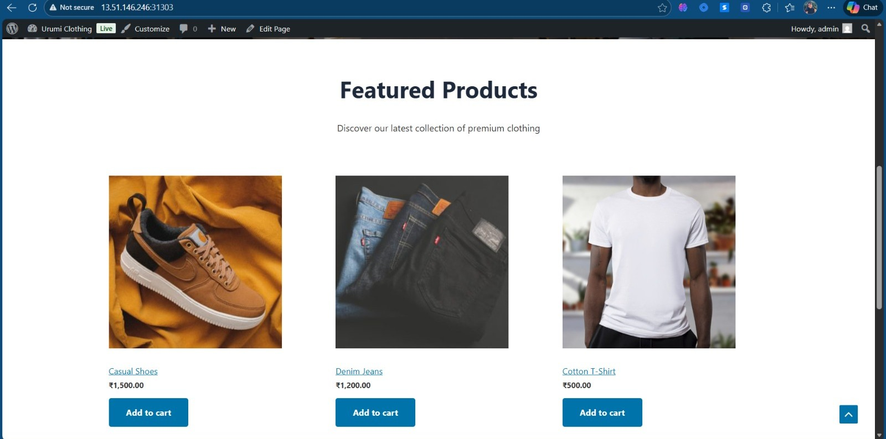
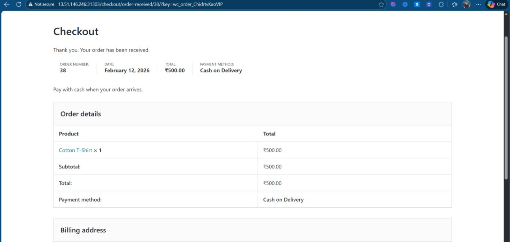
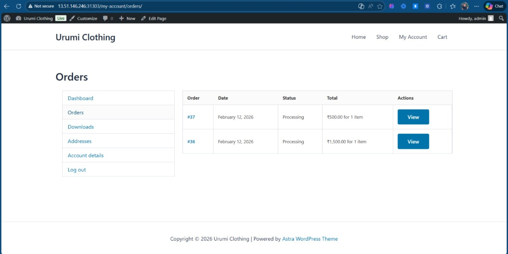

## 📌 Project Overview

This project is a cloud-deployed e-commerce platform developed to demonstrate full-stack development and basic DevOps skills.

It includes a functional online store with user authentication, product management, shopping cart, checkout system, and an admin panel. The system is deployed on AWS and is accessible through public URLs.

The project focuses on practical implementation of web technologies, cloud deployment, and version control using GitHub.

## Code Overview

The repository contains the complete source code for the platform, including frontend, backend, configuration files, and deployment scripts.

The code demonstrates:
- Web application development
- AWS cloud deployment
- Environment configuration
- Version control best practices
- Basic automation and maintenance workflows

All components are organized to support easy setup, testing, and further development.

## Live URLs

- Main Store: http://13.51.146.246:31107/
- Store Frontend: http://13.51.146.246:31303/
- Admin / Account Panel: http://13.51.146.246:31303/my-account/

## Disclaimer

“Urumi Clothing” is a fictional/sample brand name used only for demonstration purposes. This project is not associated with any real business or commercial entity.

## 📷 Project Screenshots

### Home Page


### Product Page


### Cart & Checkout


### Admin Dashboard



# Kubernetes Store Provisioning Platform

Production-ready multi-tenant WooCommerce store provisioning on Kubernetes with automated deployment, isolation, and lifecycle management.

## Architecture

```
User → React Dashboard → REST API → PostgreSQL ← Orchestrator → Helm → Kubernetes (Store Pods)
```

**Components:**
- **Backend API** (Node.js/Express) - Store CRUD, rate limiting, quotas
- **Orchestrator** (Node.js) - Reconciliation loop, Helm deployments
- **Dashboard** (React) - Store management UI
- **PostgreSQL** - Platform metadata
- **Helm Charts** - WooCommerce store templates

## Features

- **Namespace Isolation** - Each store in dedicated namespace with resource quotas (2 CPU, 4Gi RAM)
- **Auto-Installation** - WordPress, WooCommerce, sample products with images via sidecar container
- **RBAC** - Least-privilege service account permissions
- **Rate Limiting** - 100 req/15min globally, 10 stores max per user
- **Health Checks** - Liveness/readiness probes with exemption for health endpoints
- **NodePort Access** - External access via NodePort services
- **Reconciliation** - 5-30s polling with exponential backoff

## Quick Start (Production/k3s)

### Prerequisites
- k3s cluster on VPS
- kubectl configured
- Docker Hub account

### Deploy

```bash
# Clone repo
git clone <your-repo-url>
cd Urumi.ai_Round_1

# Set environment variables
export DB_PASSWORD=your_postgres_password
export KUBECONFIG=~/.kube/config

# Create namespace
kubectl create namespace store-platform

# Create postgres secret
kubectl create secret generic postgres-secret \
  --from-literal=password=$DB_PASSWORD \
  -n store-platform

# Deploy postgres
kubectl apply -f k8s/postgres-deployment.yaml

# Build and push images
docker build -t <your-dockerhub>/platform-api:latest ./backend
docker build -t <your-dockerhub>/platform-orchestrator:latest ./orchestrator
docker build -t <your-dockerhub>/platform-dashboard:latest ./frontend

docker push <your-dockerhub>/platform-api:latest
docker push <your-dockerhub>/platform-orchestrator:latest
docker push <your-dockerhub>/platform-dashboard:latest

# Update image references in k8s/*.yaml
# Then deploy
kubectl apply -f k8s/api-deployment.yaml
kubectl apply -f k8s/orchestrator-deployment.yaml
kubectl apply -f k8s/dashboard-deployment.yaml

# Apply RBAC
kubectl apply -f k8s/rbac.yaml

# Verify
kubectl get pods -n store-platform
```

### Access

- **Dashboard**: `http://<VPS_IP>:31107`
- **API**: `http://<VPS_IP>:32129/api/stores`

## Store Creation

1. Open dashboard → Create Store
2. Enter name → Submit
3. Wait 2-3 minutes for provisioning
4. Access store via NodePort URL shown in dashboard

**Auto-configured:**
- WordPress installed with admin credentials
- WooCommerce activated with INR currency, COD enabled
- 3 sample products (T-Shirt ₹500, Jeans ₹1200, Shoes ₹1500)
- Product images from Unsplash

## Technical Details

### Store Lifecycle

```
POST /api/stores → DB (provisioning) → Orchestrator polls → Helm install → Pods ready → DB (ready)
```

### Helm Chart Structure

```
orchestrator/helm-charts/woocommerce-store/
├── templates/
│   ├── namespace.yaml          # Namespace with resource quota
│   ├── deployment.yaml         # WordPress + wp-setup sidecar
│   ├── mysql-statefulset.yaml  # MySQL 8.0
│   ├── service.yaml           # NodePort service
│   └── secrets.yaml           # MySQL credentials
└── values.yaml
```

### wp-setup Sidecar

Runs as root (UID 0) in WordPress pod:
- Waits for WordPress availability
- Installs WordPress with provided credentials
- Activates and configures WooCommerce
- Downloads product images from Unsplash
- Creates 3 sample products with images
- Fixes file permissions

### Resource Quotas

Per store namespace:
```yaml
hard:
  cpu: "2"
  memory: 4Gi
  persistentvolumeclaims: "5"
  requests.storage: 20Gi
```

### Rate Limits

```javascript
// Global
windowMs: 900000 (15min)
max: 100 requests

// Store creation
max: 10 stores per user

// Health check exemption
skip: (req) => req.path === '/health'
```

## Environment Variables

### Backend (.env)
```bash
DB_HOST=postgres
DB_PASSWORD=<secret>
KUBECONFIG=/path/to/.kube/config
PLATFORM_NAMESPACE=store-platform
MAX_STORES_PER_USER=10
DEFAULT_DOMAIN_SUFFIX=.local.stores.dev
```

### Orchestrator (.env)
```bash
DB_HOST=postgres
DB_PASSWORD=<secret>
HELM_CHARTS_PATH=./helm-charts
MIN_POLL_INTERVAL_MS=5000
MAX_POLL_INTERVAL_MS=30000
```

## Troubleshooting

```bash
# Check orchestrator logs
kubectl logs -n store-platform deployment/platform-orchestrator

# Check store pods
kubectl get pods -n <store-namespace>

# Fix database password
kubectl set env deployment/platform-orchestrator \
  -n store-platform DB_PASSWORD=<correct_password>

# Fix RBAC permissions
kubectl apply -f k8s/rbac.yaml

# Force restart pods
kubectl delete pod -n <namespace> <pod-name> --force --grace-period=0

# Manually delete stuck namespace
kubectl delete namespace <store-namespace> --grace-period=0 --force
```

## Production Notes

- Use managed PostgreSQL (RDS/Cloud SQL) for production
- Enable HTTPS with cert-manager + Let's Encrypt
- Increase orchestrator replicas for higher throughput
- Monitor with Prometheus/Grafana
- Set up backup for store PVCs

## Security

- Non-root containers where possible (except wp-setup sidecar)
- Secrets stored in Kubernetes Secrets
- RBAC with least privilege
- Network policies for pod isolation
- Resource limits prevent exhaustion

## Stack

- **Backend**: Node.js 20, Express, TypeScript, PostgreSQL
- **Orchestrator**: Node.js 20, TypeScript, Helm SDK, node-postgres
- **Frontend**: React, Vite, TypeScript
- **Stores**: WordPress 6.x, WooCommerce, MySQL 8.0
- **Infrastructure**: Kubernetes (k3s), Helm 3, Docker

## Recent Commits

```
2f55d9d - Use sidecar container for WordPress auto-setup
f5f38ea - Exempt health checks from rate limiter
9dc4302 - Replace init container with Job for setup
41fe751 - Add automatic product images from Unsplash
8fc7681 - Improve WooCommerce auto-installation timing
```

## License

MIT
